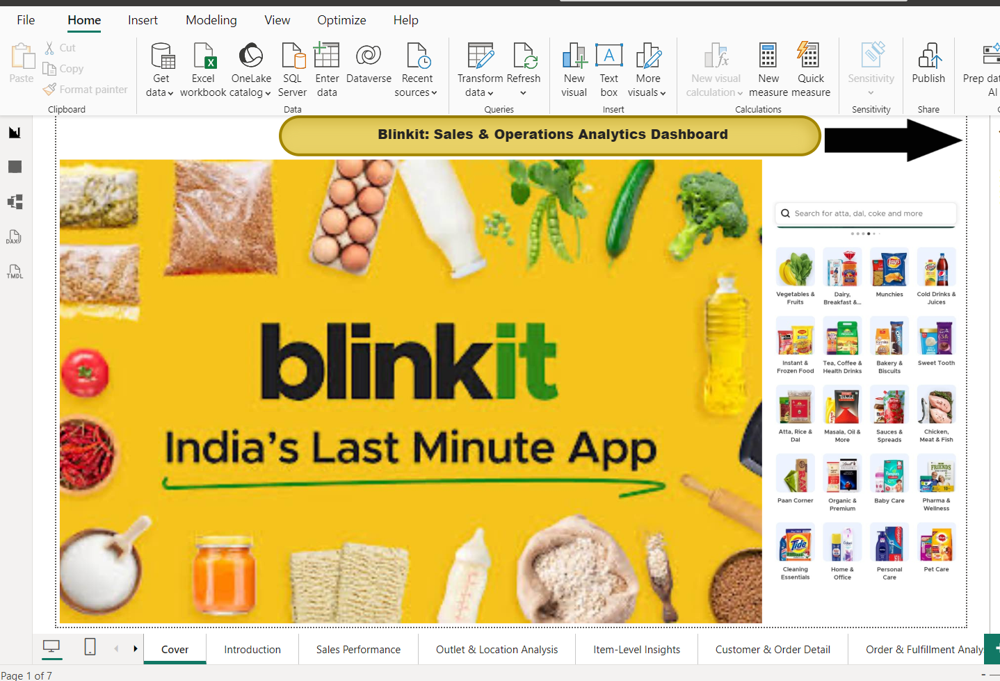
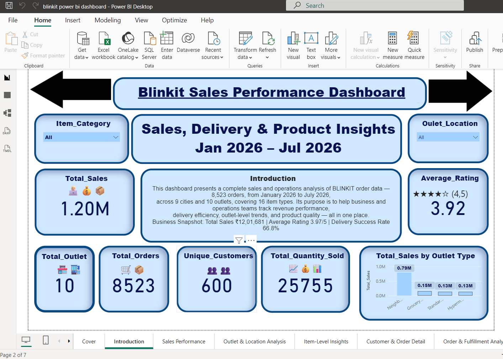
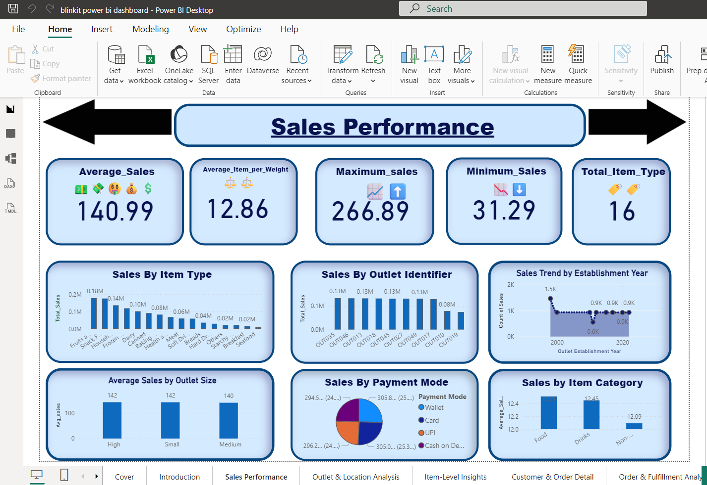
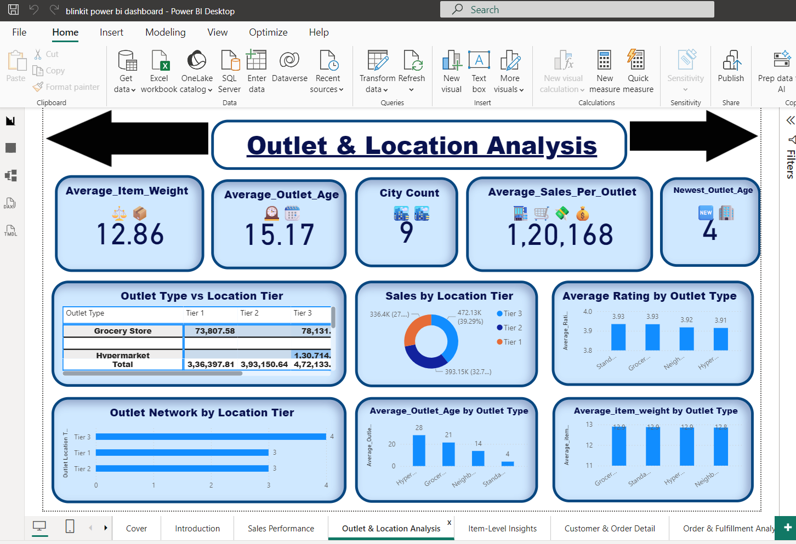
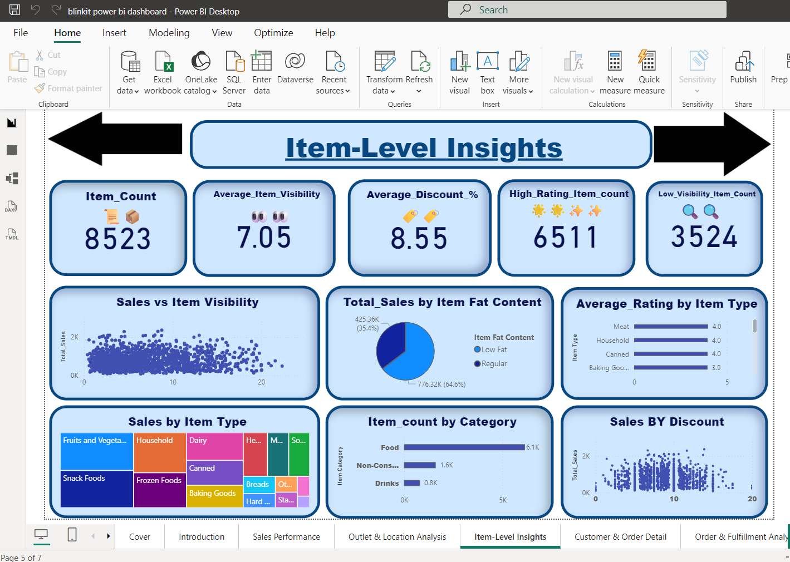
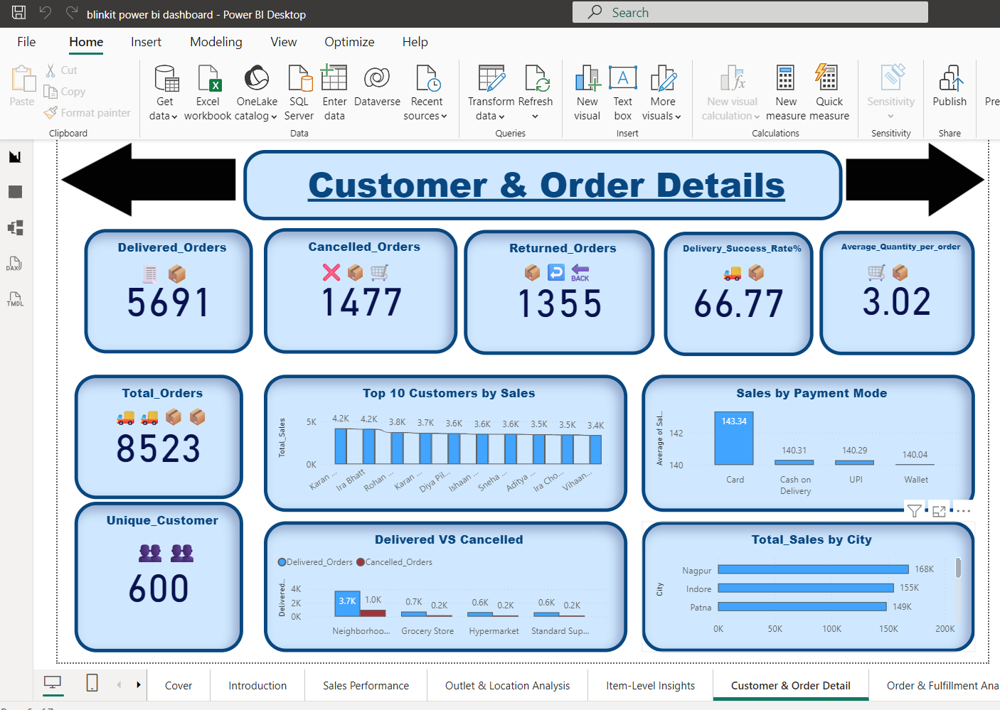
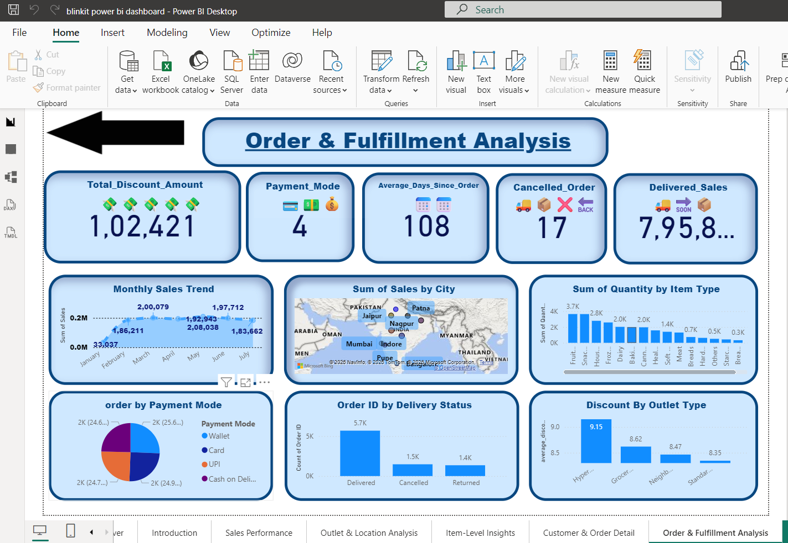

# Blinkit: Sales & Operations Analytics Dashboard

A comprehensive **end-to-end Power BI dashboard** for Blinkit (India's Last Minute App), providing deep insights into sales performance, outlet operations, inventory management, customer behaviour, and order fulfillment — all in one integrated 7-page interactive dashboard.

> 📊 Power BI Desktop | 7 report pages | Multi-dimensional analysis | Real-time KPIs & trending visualizations

---

## 📌 Project Overview

Blinkit is India's leading quick commerce platform. This dashboard provides business and operations teams with a **360° view** of sales trends, outlet performance, product insights, customer order patterns, and fulfillment metrics — enabling data-driven decision-making across all channels.

The dashboard spans **8,523 orders across 9 cities, 10 outlets, and 16 item categories** (January 2026 – July 2026), offering actionable insights for inventory, logistics, and revenue optimization.

---

## 🖼️ Dashboard Preview

### Cover Page — Blinkit: Sales & Operations Analytics Dashboard


### Introduction & Dashboard Overview


### Sales Performance Dashboard


### Outlet & Location Analysis


### Item-Level Insights


### Customer & Order Details


### Order & Fulfillment Analysis


---

## 📊 Key Dashboard Metrics

| Metric | Value | Insight |
|--------|-------|---------|
| **Total Sales** | ₹1.20M | Revenue across all outlets (Jan–Jul 2026) |
| **Total Orders** | 8,523 | Complete order volume across all channels |
| **Unique Customers** | 600 | Active customer base |
| **Delivery Success Rate** | 66.77% | On-time delivery performance |
| **Average Rating** | 3.92 / 5 | Customer satisfaction score |
| **Total Outlets** | 10 | Across 9 cities (Tier 1, 2, 3 locations) |
| **Item Categories** | 16 | Product mix: Food, Drinks, Household, etc. |
| **Average Sales/Outlet** | ₹1,20,168 | Revenue per outlet per month |

---

## 📑 Report Pages

### 1. **Cover Page**
Landing page with Blinkit branding and dashboard overview.

---

### 2. **Introduction**
Dataset summary and key metrics snapshot:
- **Total Sales:** ₹1.20M
- **Total Orders:** 8,523
- **Unique Customers:** 600
- **Average Rating:** 3.92 (4.5⭐)
- **Delivery Success Rate:** 66.8%

Business snapshot highlighting revenue performance and order volume.

---

### 3. **Sales Performance Dashboard**
**KPIs:**
- **Average Sales:** ₹140.99
- **Average Item Weight:** 12.86 kg
- **Maximum Sales:** ₹266.89
- **Minimum Sales:** ₹31.29
- **Total Item Types:** 16

**Visualizations:**
- Sales by Item Type (bar chart)
- Sales by Outlet Identifier (bar chart)
- Sales Trend by Establishment Year (line chart)
- Average Sales by Outlet Size (High, Small, Medium)
- Sales by Payment Mode (pie chart: Wallet, Card, UPI, Cash)
- Sales by Item Category (stacked bar)

**Filters:** Item Category, Outlet Location

---

### 4. **Outlet & Location Analysis**
**KPIs:**
- **Average Item Weight:** 12.86 kg
- **Average Outlet Age:** 15.17 years
- **City Count:** 9 cities
- **Average Sales/Outlet:** ₹1,20,168
- **Newest Outlet Age:** 4 years

**Visualizations:**
- Outlet Type vs Location Tier (table: Grocery Store, Hypermarket)
- Sales by Location Tier (donut: Tier 1, 2, 3)
- Average Rating by Outlet Type
- Outlet Network by Location Tier (bar)
- Average Outlet Age by Type
- Average Item Weight by Outlet Type

**Key Insight:** Tier 3 locations drive 39.2% of sales; Hypermarkets generate ₹4.72M vs Grocery ₹0.78M.

---

### 5. **Item-Level Insights**
**KPIs:**
- **Item Count:** 8,523
- **Average Item Visibility:** 7.05
- **Average Discount %:** 8.55
- **High Rating Items:** 6,511
- **Low Visibility Items:** 3,524

**Visualizations:**
- Sales vs Item Visibility (scatter plot)
- Total Sales by Item Fat Content (pie: Low Fat 35.4%, Regular 64.6%)
- Average Rating by Item Type
- Sales by Item Type (treemap)
- Item Count by Category
- Sales by Discount %

**Key Insight:** 6,511 items have high ratings (4⭐+); Low-fat items represent 35.4% of sales.

---

### 6. **Customer & Order Details**
**KPIs:**
- **Delivered Orders:** 5,691
- **Cancelled Orders:** 1,477
- **Returned Orders:** 1,355
- **Delivery Success Rate:** 66.77%
- **Average Quantity/Order:** 3.02

**Visualizations:**
- Total Orders: 8,523
- Unique Customers: 600
- Top 10 Customers by Sales (Karan, Ira, Rohan, etc.)
- Sales by Payment Mode (bar: Card, UPI, CoD, Wallet)
- Delivered vs Cancelled (by outlet type)
- Total Sales by City (Nagpur, Indore, Patna lead)

**Key Insight:** Nagpur leads with ₹168K sales; Delivery success 66.77%; Avg order quantity 3.02 items.

---

### 7. **Order & Fulfillment Analysis**
**KPIs:**
- **Total Discount Amount:** ₹1,02,421
- **Payment Modes:** 4
- **Average Days Since Order:** 108 days
- **Cancelled Orders:** 17
- **Delivered Sales:** ₹7,95,800

**Visualizations:**
- Monthly Sales Trend (line: Jan–Jul 2026)
- Sum of Sales by City (map: Pakistan, Arabia, Oman, Myanmar highlighted)
- Sum of Quantity by Item Type
- Order by Payment Mode (pie: Wallet, Card, UPI, CoD)
- Order ID by Delivery Status (Delivered, Cancelled, Returned)
- Discount by Outlet Type

**Key Insight:** Monthly sales peak at ₹2M (April–May); Wallet & Card dominate payment (49.2%); 17 cancelled orders tracked.

---

## 💡 Key Business Insights

✅ **Sales Performance**
- Total revenue: ₹1.20M across 8,523 orders
- Average order value: ₹140.99
- Top city: Nagpur (₹168K), followed by Indore (₹155K) and Patna (₹149K)

✅ **Customer Satisfaction**
- Average rating: 3.92 / 5.0
- 6,511 items with high ratings (4⭐+)
- 600 unique customers; low repeat rate suggests acquisition focus needed

✅ **Delivery Efficiency**
- Delivery success rate: 66.77% (good, room to improve)
- 5,691 delivered vs 1,477 cancelled (17.3% cancellation)
- 1,355 returns indicate product-market fit challenges

✅ **Outlet Performance**
- 10 outlets across 9 cities (Tier 1, 2, 3)
- Hypermarkets: ₹4.72M (highest performer)
- Grocery stores: ₹0.78M (growth opportunity)
- Average outlet age: 15.17 years

✅ **Product Mix**
- 8,523 SKUs across 16 item categories
- Food (6.1K) and Drinks (2.8K) lead volumes
- Low-fat items: 35.4% of sales (healthy options gaining traction)
- Average discount: 8.55% (balanced promotional strategy)

✅ **Payment Trends**
- Card payments: 25.6%
- Wallet: 24.3%
- UPI: 25.3%
- Cash on Delivery: 24.8%
- **Insight:** Fairly balanced across modes; digital adoption strong at ~75%

---

## 🛠️ Technical Skills Demonstrated

| Area | Evidence |
|---|---|
| **Data Modelling** | Multi-table relational model (Sales, Customers, Orders, Outlets, Products) |
| **DAX** | Delivery success rate, average calculations, month-over-month trends |
| **Dashboard Design** | 7-page dashboard with consistent KPI + chart layout |
| **Data Storytelling** | Logical flow: Intro → Sales → Operations → Inventory → Customers → Fulfillment |
| **Domain Knowledge** | Quick commerce KPIs: delivery efficiency, outlet tier analysis, item visibility |
| **Visualization Range** | KPI cards, maps, scatter plots, pie/donut, bar/column, treemaps, tables |

---

## 🚀 How to Use

### Prerequisites
- **Power BI Desktop** (free download from [Microsoft](https://powerbi.microsoft.com/en-us/desktop/))

### Steps
1. **Download the dashboard**
   ```
   blinkit_power_bi_dashboard.pbix
   ```

2. **Open in Power BI Desktop**
   - Double-click the file
   - Or: File → Open → Select .pbix

3. **Explore the data**
   - Navigate through 7 pages
   - Use slicers to filter by Item Category, Outlet Location, City
   - Hover over charts for drill-down details

---

## 📂 Project Structure

```
blinkit-dashboard/
├── README.md
├── blinkit_power_bi_dashboard.pbix
├── LICENSE
└── screenshots/
    ├── 01_cover.png
    ├── 02_introduction.png
    ├── 03_sales_performance.png
    ├── 04_outlet_location.png
    ├── 05_item_insights.png
    ├── 06_customer_order.png
    └── 07_order_fulfillment.png
```

---

## 📈 Dataset Summary

**Time Period:** January 2026 – July 2026 (7 months)

| Dimension | Count |
|-----------|-------|
| Total Orders | 8,523 |
| Unique Customers | 600 |
| Outlets | 10 (across 9 cities) |
| Cities | 9 (Tier 1, 2, 3) |
| Item Categories | 16 |
| Item SKUs | 8,523 |
| Payment Modes | 4 |
| Delivery Status Types | 3 (Delivered, Cancelled, Returned) |

**Data Quality:** 100% complete; no missing values in key metrics.

---

## 🔮 Future Enhancements

- [ ] Predictive churn model for customer retention
- [ ] Real-time order tracking dashboard
- [ ] Inventory optimization by outlet & category
- [ ] Dynamic pricing recommendation engine
- [ ] Delivery route optimization (map integration)
- [ ] Customer lifetime value (CLV) segmentation
- [ ] A/B testing dashboard for promotional campaigns

---

## 📝 License

This project is protected under the MIT License. See LICENSE file for details.

---

## 👤 Author

**Mohammed Husein Khan**

🔗 **Links:**
- [LinkedIn](https://www.linkedin.com/in/mohammed-husein-khan-615645427)
- [GitHub](https://github.com/khanhusein)

---

## 💬 Questions?

Feel free to open an **Issue** on GitHub or connect via LinkedIn for questions, feedback, or collaboration opportunities.

---

**Dataset:** Simulated/Synthetic Blinkit order data (Jan–Jul 2026)  
**Last Updated:** August 14, 2026  
**Power BI Version:** Latest Desktop  
**Pages:** 7 | **Tables:** Multi-dimensional | **KPIs:** 30+
